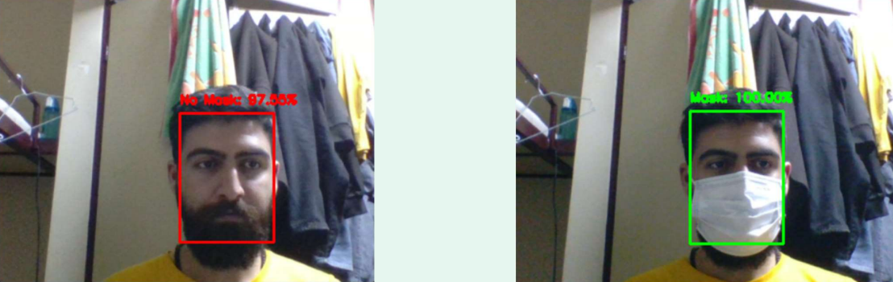

# Real-Time Face Mask Detection Unsing MobileNetV2

#### This project was written during the spread of the [COVID-19 pandemic](https://en.wikipedia.org/wiki/COVID-19_pandemic) and the need to recognize people wearing masks.
#### In this project, you can recognize masked faces in real time
#### I use [MobileNet](https://github.com/chandrikadeb7/Face-Mask-Detection) in this project for create a model of train network.

## :key: Prerequisites
All the dependencies and required libraries are included in the file <code>requirements.txt</code> [see here](https://github.com/rezaAdinepour/Real-Time-Face-Mask-Detection/blob/main/requirements.txt)

## 🚀&nbsp; Installation
1. Clone the repo
```
$ git clone https://github.com/rezaAdinepour/Real-Time-Face-Mask-Detection.git
```

2. Change your directory to the cloned repo 
```
$ cd Face-Mask-Detection
```

3. Create a Python virtual environment named 'test' and activate it
```
$ virtualenv test
```
```
$ source test/bin/activate
```

4. Now, run the following command in your Terminal to install the libraries required
```
$ pip3 install -r requirements.txt
```

## :bulb: Working

1. Open terminal. Go into the cloned project directory and type the following command for train network:
```
$ python3 train_mask_detector.py
```
3. To detect face masks in real-time video streams type the following command:
```
$ python3 detect_mask_video.py 
```

## :key: Results

